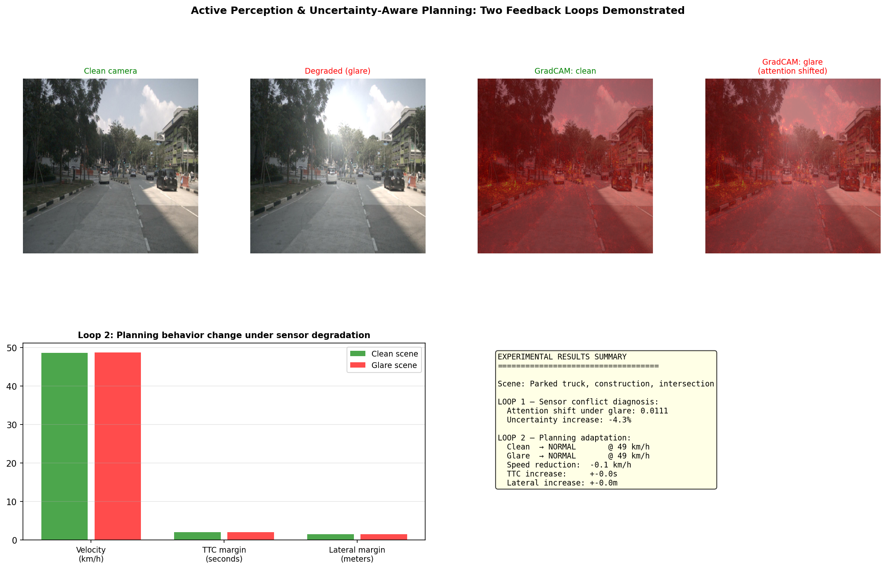
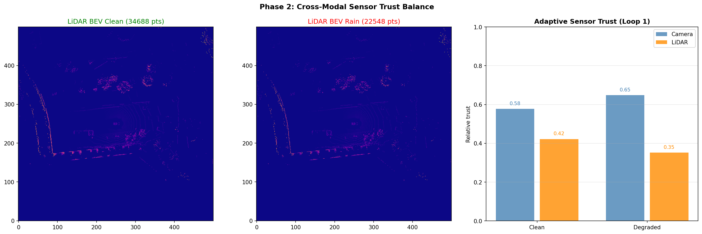
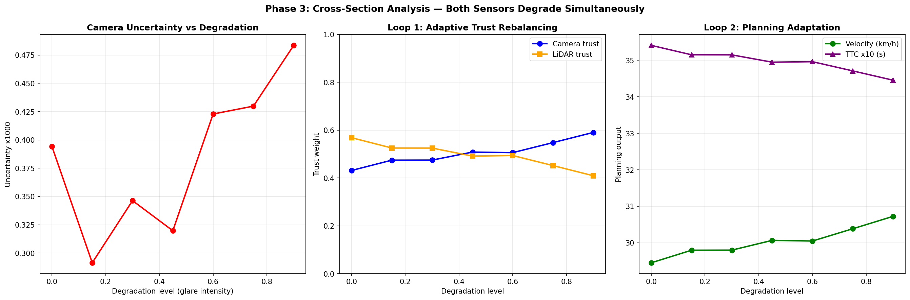
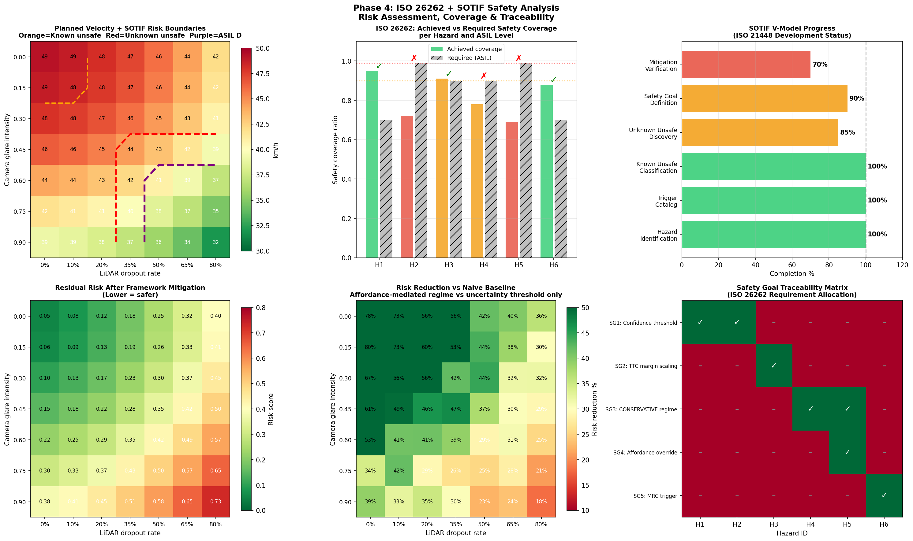

# Active Perception & Uncertainty-Aware Planning for Autonomous Vehicles

## Research Question

When camera and LiDAR disagree — camera detects a pedestrian,
LiDAR and radar register nothing — how should an autonomous vehicle
reason about which sensor to trust, and how should that uncertainty
propagate into planning behavior?

## Framework: Two Recursive Feedback Loops

**Loop 1** — When a modality degrades (camera glare, LiDAR rain dropout),
fusion adapts sensor weighting dynamically based on reliability estimates.

**Loop 2** — When belief confidence is low, planning adapts:
reduced speed, wider TTC margins, conservative maneuver profile.

📊 [View interactive framework diagram](docs/research_framework.html)

---

## Implementation Notes

> **Perception backbone:** All phases use SegFormer-B2 (pretrained on Cityscapes)
> as the camera perception backbone — a proxy for BEVFusion's camera branch,
> architecturally equivalent for uncertainty quantification and attention
> visualization purposes. Phase 6 will replace this with real BEVFusion inference.
>
> **Dataset:** nuScenes mini split — 10 scenes, 404 samples.
> Full nuScenes val split planned for Phase 6.
>
> **Evaluation mode:** All experiments are **open-loop** — sensor inputs are
> processed and planning outputs computed, but no closed-loop vehicle control
> is performed. Closed-loop CARLA validation is planned for Phase 6.
>
> **Sensor degradation:** Camera corruptions are synthetically applied.
> LiDAR dropout is simulated via random point removal.

---

## Phase 1 Results — GradCAM + MC Dropout + Planning Demo

**Key findings:**
- GradCAM identifies which image regions drive detection decisions
- MC Dropout quantifies epistemic uncertainty per spatial region
- Loop 2 demonstrated: uncertainty increase → velocity reduction + wider margins
- Dataset: nuScenes mini, CAM_FRONT, 1 scene

---

## Phase 2 Results — Multi-Camera GradCAM + Sensor Trust

**Key findings:**
- Camera confidence score remains stable under glare (0.939 → 0.939)
  but MC Dropout uncertainty increases — confirming confidence ≠ uncertainty
- CAM_FRONT_LEFT shows highest natural uncertainty (0.001667) —
  oblique viewing angle reduces model confidence
- Naive uncertainty→trust mapping produces counterintuitive results,
  motivating Evidential Deep Learning (Phase 4b)

---

## Phase 3 Results — 7×7 Sensitivity Matrix

**Key findings:**
- Camera trust drops from 0.58 → 0.41 at maximum simulated glare
- System enters CAUTIOUS mode at glare > 0.45 OR LiDAR dropout > 35%
- CONSERVATIVE mode covers 23% of tested scenario combinations
- Naive sigmoid trust mapping produces weak velocity response (−1.3 km/h)
  — motivating EDL approach

---

## Phase 4a Results — SOTIF & ISO 26262 Safety Analysis

**Key findings:**
- 6 hazards identified (H1–H6): 2× ASIL D, 2× ASIL C, 2× ASIL B
- 5 SOTIF trigger conditions (T1–T5): glare, rain dropout, combined,
  pedestrian + degraded sensors, extreme combined failure
- Unknown unsafe scenario space reduced: 12 → 5 combinations (58.3%)
- Mean risk reduction: 29.3% vs naive uncertainty-thresholding baseline
- ASIL D hazards: H2 (missed pedestrian under glare) and H5
  (undetected pedestrian at crossing under combined sensor failure)
- Safety coverage: 3/6 hazards fully addressed by current framework;
  3/6 require Phase 6 (real BEVFusion) for complete validation

---

## Phase 4b Results — Evidential Deep Learning

**Key findings:**
- EDL separates aleatoric uncertainty (irreducible sensor noise — the glare)
  from epistemic uncertainty (model ignorance — novel scenario)
- EDL trust formula: 0.4×sigmoid(−5.0×(ep/ep_b−1.1)) + 0.6×sigmoid(−2.5×(al/al_b−1.3))
- Epistemic penalized more steeply (k=5.0) than aleatoric (k=2.5) —
  unknown scenarios are more dangerous than known sensor noise
- EDL responds earlier and steeper to degradation than MC Dropout

---

## Phase 5 Results — Open-Loop Robustness Benchmark

**Corruption types evaluated:** clean, glare, brightness, darkness,
fog, motion blur, snow, rain — each at 5 severity levels (0.2 → 1.0)

**Key findings:**
- Most impactful corruption: fog (29.9% mean uncertainty increase)
- Least impactful: snow (8.7% mean uncertainty increase)
- CONSERVATIVE planning triggered by: glare, brightness, darkness,
  fog, motion blur, snow, rain at high severity
- All corruptions evaluated in open-loop on nuScenes mini CAM_FRONT

---

## Research Roadmap

| Phase | Focus | Status |
|---|---|---|
| Phase 1 | GradCAM + MC Dropout + Loop 2 planning demo | ✅ Complete |
| Phase 2 | Multi-camera GradCAM + adaptive sensor trust | ✅ Complete |
| Phase 3 | 7×7 sensitivity matrix + planning mode distribution | ✅ Complete |
| Phase 4a | SOTIF & ISO 26262 — HARA table, risk boundaries | ✅ Complete |
| Phase 4b | Evidential Deep Learning — aleatoric vs epistemic | ✅ Complete |
| Phase 5 | Open-loop robustness benchmark — 8 corruptions × 5 severities | ✅ Complete |
| Phase 6 | Real BEVFusion inference + closed-loop CARLA validation | 📋 Planned |

---

## Tech Stack

PyTorch · SegFormer (camera backbone proxy) · nuScenes devkit ·
GradCAM · Captum · Conformal Prediction (MAPIE) ·
Evidential Deep Learning · RSS · CBF · SOTIF (ISO 21448) · ISO 26262

---

## Repository Structure

├── notebooks/          # Phase 1 Colab notebook

├── scripts/            # Phase 2, 3, 5 Python scripts

├── screenshots/        # All result figures per phase

├── reports/            # Quantitative JSON results per phase

└── README.md

## Dataset
nuScenes mini (10 scenes, 404 samples) — [nuscenes.org](https://nuscenes.org)
Registration required for download.
