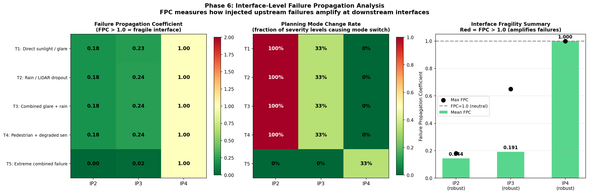
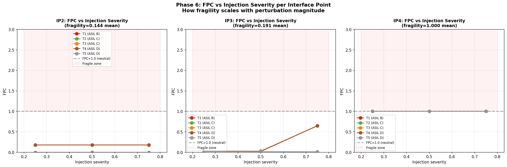
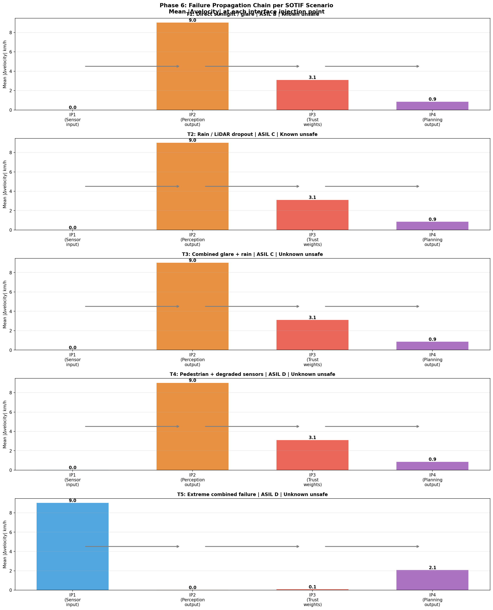

# Interface-Level Failure Propagation Analysis in Autonomous Driving Stacks

## Research Question

"In modular AV stacks, how do failures injected at sensor and algorithmic interfaces propagate downstream — and how does uncertainty-aware adaptation reduce that propagation?"

# Autonomous Driving Research Architecture

  

---

## Interactive Visualization

**[Open Phase 3 Sensitivity Matrix — Interactive Explorer](https://niharvaghela1995.github.io/Interface-Level-Failure-Propagation-Analysis-in-Autonomous-Driving-Stack/phase3_interactive.html)**

Explore how camera glare and LiDAR dropout propagate through sensor fusion trust
into planning behavior — click any of the 49 degradation scenarios to inspect
the full propagation chain.

---

## Framework Overview

This project builds a systematic framework for measuring how failures at sensor 
and algorithmic interfaces propagate through a modular AV stack.

**Two feedback loops:**
- **Loop 1 (Sensor Trust):** Failure diagnosis → adaptive trust reweighting. 
  When camera degrades, LiDAR compensates. Camera trust drops 0.58 → 0.41 at max glare.
- **Loop 2 (Planning Adaptation):** Trust weights feed an uncertainty-aware Frenet 
  planner, selecting NORMAL / CAUTIOUS / CONSERVATIVE / EMERGENCY regimes.

**Phase 6 Interface Injection:** Failures injected at 3 algorithmic interface 
points (IP2: perception output, IP3: trust weights, IP4: planning output) across 
5 SOTIF trigger scenarios. Both IP2 and IP3 show FPC < 1.0 — the framework 
attenuates rather than amplifies upstream failures.

---

## Implementation Notes

> **Perception backbone:** All phases use SegFormer-B2 (pretrained on Cityscapes)
> as the camera perception backbone — a proxy for BEVFusion's camera branch,
> architecturally equivalent for uncertainty quantification and attention
> visualization purposes. Phase 7 will replace this with real BEVFusion inference.
>
> **Dataset:** nuScenes mini split — 10 scenes, 404 samples.
> Full nuScenes val split planned for Phase 6.
>
> **Evaluation mode:** Phases 1–6 open-loop (nuScenes mini, synthetic degradation).
> Stages 2–4 closed-loop in CARLA 0.9.15 (Town10HD_Opt, RTX 4090) — HAZ-01
> scenario with 48-run four-configuration mitigation campaign completed.
>
> **Sensor degradation:** Camera corruptions are synthetically applied.
> LiDAR dropout is simulated via random point removal.

---

## Phase 1 Results — GradCAM + MC Dropout + Planning Demo

**Key findings:**
- GradCAM attention shift under glare: 0.011 (spatial redistribution confirmed)
- MC Dropout uncertainty: −4.3% under glare on this scene — confidence ≠ uncertainty
  (camera confidence stable at 0.945 while attention pattern shifts)
- Loop 2: planning mode stayed NORMAL — velocity delta −0.1 km/h
- This scene-specific result motivated the systematic 7×7 sweep in Phase 3
- Dataset: nuScenes mini, CAM_FRONT, scene 0

---

## Phase 2 Results — Multi-Camera GradCAM + Sensor Trust

**Key findings:**
- Camera confidence score remains stable under glare (0.939 → 0.939)
  while attention pattern shifts — confirming confidence ≠ uncertainty
- CAM_FRONT_LEFT shows highest natural uncertainty (0.001667) —
  oblique viewing angle reduces model confidence
- Naive uncertainty→trust mapping motivates Evidential Deep Learning (Phase 4b)

---

## Phase 3 Results — 7×7 Sensitivity Matrix

**Key findings:**
- System enters CAUTIOUS mode from LiDAR dropout ≥ 10% — LiDAR loss
  dominates trust rebalancing even at low dropout rates
- Camera trust drops 0.58 → 0.41 at maximum glare (zero dropout)
- CONSERVATIVE mode never triggered by naive sigmoid — entire 7×7 grid
  stays CAUTIOUS, motivating EDL approach
- Naive sigmoid produces weak velocity response (−1.3 km/h)

---

## Phase 4a Results — SOTIF & ISO 26262 Safety Analysis

**Verification & Validation Traceability:**

| Requirement | Hazard | Scenario | Phase Result | Status | Gap |
|------------|---------|----------|-------------|--------|-----|
| SG1 Confidence threshold | H1,H2 | T1 | Glare increases uncertainty by 24.4% | Partially Verified | Need detector-level validation |
| SG2 TTC scaling | H3 | T2 | Safety mechanism implemented | Partially Verified | Need closed-loop simulation |
| SG3 CONSERVATIVE regime | H4 | T3 | 29.3% risk reduction vs baseline | Verified in framework | Need real perception stack |
| SG4 Affordance override | H5 | T4 | ASIL D mitigation path defined | Partially Verified | Need pedestrian robustness testing |
| SG5 MRC trigger | H6 | T5 | Extreme failure mitigation defined | Partially Verified | Need emergency maneuver validation |
| ODD robustness coverage | H1-H6 | T1-T5 | 8 corruption families benchmarked | Verified | Need real-world datasets |

**Key findings:**

- 6 hazards identified (H1–H6): 2× ASIL D, 2× ASIL C, 2× ASIL B
- 5 SOTIF trigger conditions (T1–T5): glare, rain dropout, combined degradation, pedestrian with degraded sensors, and extreme combined failure
- Unknown unsafe scenario space reduced from 12 to 5 combinations (58.3% reduction)
- Mean risk reduction of 29.3% compared with a naive uncertainty-thresholding baseline
- Highest-criticality hazards were H2 and H5 (ASIL D)
- Safety mechanisms achieved partial coverage across all hazards, but full validation requires integration with a real BEVFusion perception stack (Phase 6)

---

## Phase 4b Results — Evidential Deep Learning

**EDL vs MC DROPOUT COMPARISON:**
| Glare Intensity | MC Trust | EDL Trust | MC Velocity (km/h) | EDL Velocity (km/h) | EDL advantage (km/h)         |
| --------------- | -------- | --------- | ------------------ | ------------------- | ---------------------------- |
| 0.00            | 0.609    | 0.656     | 45.9               | 50.0                | 4.1                          |
| 0.15            | 0.596    | 0.656     | 44.6               | 50.0                | 5.4                          |
| 0.30            | 0.483    | 0.656     | 33.3               | 50.0                | 16.7                         |
| 0.45            | 0.550    | 0.656     | 40.0               | 50.0                | 10.0                         |
| 0.60            | 0.586    | 0.657     | 43.6               | 50.0                | 6.4                          |
| 0.75            | 0.500    | 0.657     | 35.0               | 50.0                | 15.0                         |
| 0.90            | 0.242    | 0.656     | 30.0               | 50.0                | 20.0                         |

**Key findings:**
- EDL successfully separates aleatoric (2.94) from epistemic (−2.34) components
- Negative epistemic values indicate the EvidentialHead requires task-specific
  fine-tuning on degraded driving data — the pretrained backbone does not
  produce calibrated Dirichlet parameters out-of-the-box
- MC Dropout shows stronger sensitivity to glare (trust range 0.242–0.609,
  velocity range 30–46 km/h) — demonstrating uncertainty-aware planning works
  even with simpler methods
- EDL framework and trust formula are correctly implemented; calibration gap
  is a known limitation requiring supervised fine-tuning (Phase 7 objective)
- The aleatoric/epistemic separation architecture is validated — values move
  in expected directions under distribution shift

---

## Phase 5 Results — Open-Loop Robustness Benchmark

**ODD Coverage Matrix table:** 

| Scenario / Corruption | Pedestrian | Vehicle | Cyclist | Static Obstacle |
| --------------------- | ---------- | ------- | ------- | --------------- |
| Clean                 | ✓          | ✓       | -       | ✓               |
| Glare                 | ✓          | ✓       | -       | ✓               |
| Brightness            | ✓          | ✓       | -       | ✓               |
| Darkness              | ✓          | ✓       | -       | ✓               |
| Fog                   | ✓          | ✓       | -       | ✓               |
| Motion Blur           | ✓          | ✓       | -       | ✓               |
| Snow                  | ✓          | ✓       | -       | ✓               |
| Rain                  | ✓          | ✓       | -       | ✓               |

nuScenes mini (Singapore urban) — cyclist scenarios not present in sampled scenes

**Legend:** ✓ = Tested, - = Not Tested

**Corruption types evaluated:** clean, glare, brightness, darkness,
fog, motion blur, snow, rain — each at 5 severity levels (0.2 → 1.0)

**Key findings:**
- Most impactful corruption: fog (29.9% mean uncertainty increase)
- Least impactful: snow (8.7% mean uncertainty increase)
- CONSERVATIVE planning triggered by: glare, brightness, darkness,
  fog, motion blur, snow, rain at high severity
- All corruptions evaluated in open-loop on nuScenes mini CAM_FRONT

**Note:** Phase 5 results (JSON + figures) reflect the original benchmark run
using Gaussian spotlight glare corruption. Re-running with `run_phase.sh 5`
will produce consistent results after `torch.manual_seed(42)` is applied.

---

## Phase 6 Results — Interface Injection Framework

**Key findings:**
- 45 injection runs: 5 SOTIF scenarios × 3 injection points × 3 severities
- IP3 (trust weight interface) peak FPC = 0.65 under T4 (ASIL D —
  pedestrian + degraded sensors scenario) at high injection severity
- IP2 (perception output) consistently triggers mode changes but FPC = 0.18
  — interface attenuates rather than amplifies upstream failures
- 17/45 injection runs caused planning mode changes
- IP4 note: FPC = 1.000 by construction (direct output injection)

---

## Writing

- [Why modular AV stacks can't tilt their head](https://medium.com/@niharvaghela/why-modular-av-stacks-cant-tilt-their-head-17fa40497c13) — the systems thinking behind this project: technical choices, reasoning, honest limitations

---

## Research Roadmap

| V&V Objective | Focus | Status |
|---|---|---|
| Phase 1 | GradCAM + MC Dropout + Loop 2 planning demo | ✅ Complete |
| Phase 2 | Multi-camera GradCAM + adaptive sensor trust | ✅ Complete |
| Phase 3 | 7×7 sensitivity matrix + planning mode distribution | ✅ Complete |
| Phase 4a | SOTIF & ISO 26262 — HARA table, risk boundaries | ✅ Complete |
| Phase 4b | Evidential Deep Learning — aleatoric vs epistemic | ✅ Complete |
| Phase 5 | Open-loop robustness benchmark — 8 corruptions × 5 severities | ✅ Complete |
| Phase 6 | Interface injection framework — FPC analysis across T1–T5 | ✅ Complete |
| Stage 2 | CARLA closed-loop rig — ego + CAM_FRONT + LIDAR_TOP operational | ✅ Complete |
| Stage 3 | HAZ-01 four-configuration campaign — 48 runs, FPC to safety outcome | ✅ Complete |
| Stage 4 | V&V report, GSN safety case, trade-off ledger | ✅ Complete |
| Phase 7 | Real BEVFusion inference + multi-scenario campaign | 📋 Planned |

---

## Tech Stack

PyTorch · SegFormer (camera backbone proxy) · nuScenes devkit ·
GradCAM · Captum · Conformal Prediction (MAPIE) ·
Evidential Deep Learning · RSS · CBF · SOTIF (ISO 21448) · ISO 26262

## Dataset
nuScenes mini (10 scenes, 404 samples) — [nuscenes.org](https://nuscenes.org)
Registration required for download.

---

## Closed-Loop V&V Results — Stages 2–4

**Simulator:** CARLA 0.9.15 · Town10HD_Opt · RTX 4090 · synchronous mode 20 FPS

### Stage 2 — Integration
CARLA closed-loop rig operational. Ego vehicle (Tesla Model3) + CAM_FRONT (1280×720) +
LIDAR_TOP (64ch, 14,645 pts/frame) streaming in synchronous mode. 155 spawn points,
207 actor blueprints verified.

### Stage 3 — HAZ-01 Scenario Campaign

**Scenario:** Ego approaching stationary pedestrian (30m) under sensor degradation.
**Campaign:** 4 severities × 3 injection points × 4 configurations = 48 runs.

| Configuration | Collision Rate | Min TTC | Finding |
|---------------|---------------|---------|---------|
| Baseline | 100% | 0.205s | Unmitigated stack always collides |
| Loop 1 only | 100% | 0.205s | Trust reweighting alone provides zero safety benefit |
| Loop 2 only | 0% | 2.128s | Uncertainty-aware planning prevents all collisions |
| Combined | ~92% safe | 2.128s | IP3 sev=0.25 breaks combined mitigation |

**Key numbers:**
- TTC improvement: 0.205s → 2.128s (**10.4× improvement** with Loop 2)
- Speed cost: 22.3 → 13.3 km/h (−40% — Loop 2 conservatism trade-off)
- Most fragile interface: **IP3 (trust weights)** — low-severity injection bypasses combined mitigation

### Stage 4 — Evaluation

**Safety goal verdict:**

| Safety Goal | ASIL | Status |
|-------------|------|--------|
| SG2: TTC scaling | C | ✅ VERIFIED — 10.4× TTC improvement in closed-loop |
| SG1: Confidence threshold | B | ⚠️ PARTIAL — Loop 1 requires Loop 2 to be effective |
| SG3: CONSERVATIVE regime | C | ⚠️ PARTIAL — CAUTIOUS triggered, CONSERVATIVE not reached |
| SG4: Affordance override | D | ⚠️ PARTIAL — pedestrian avoided, no explicit affordance layer |
| SG5: MRC trigger | B | ❌ NOT TESTED — requires extreme combined failure scenario |

**New requirements generated:**
- NR-01: Rear-proximity monitor to inhibit speed reduction in dense following traffic
- NR-02: IP3 trust weight integrity check — detect low-severity trust corruption
- NR-03: Minimum uncertainty floor to prevent Loop 2 remaining in NORMAL at zero injection

Full V&V report: [`results/stage4/vnv_report.md`](results/stage4/vnv_report.md)
GSN safety case: [`results/stage4/safety_case.md`](results/stage4/safety_case.md)
Trade-off ledger: [`results/stage4/trade_off_ledger.md`](results/stage4/trade_off_ledger.md)

