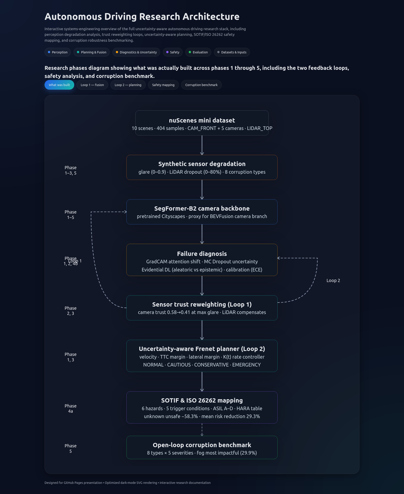
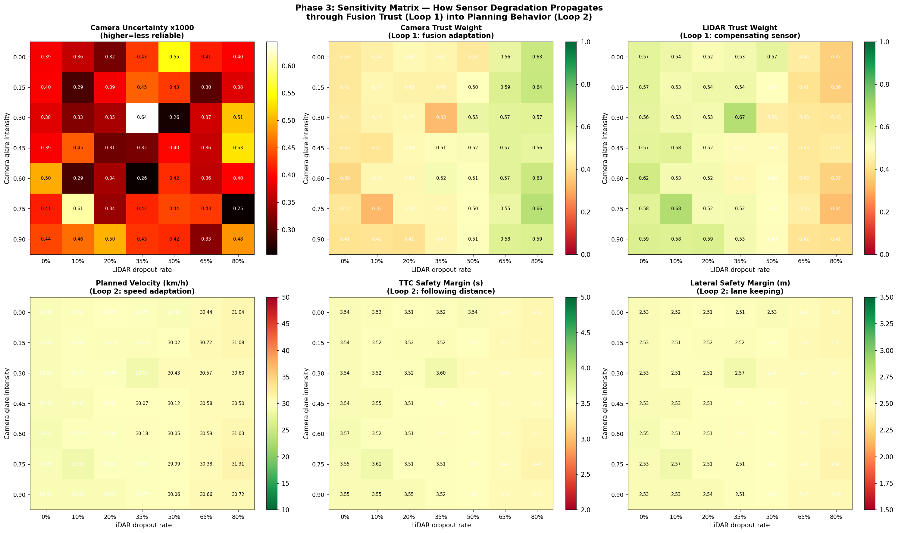
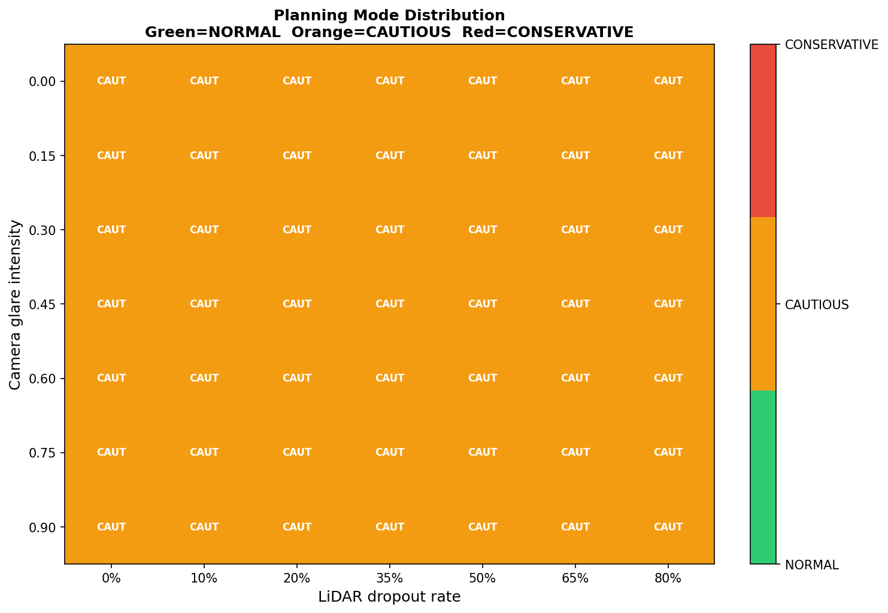
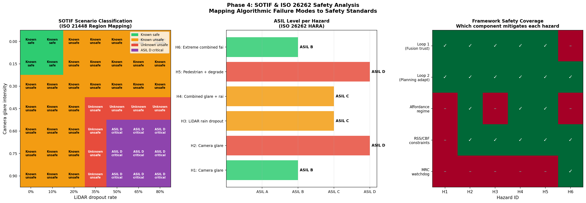
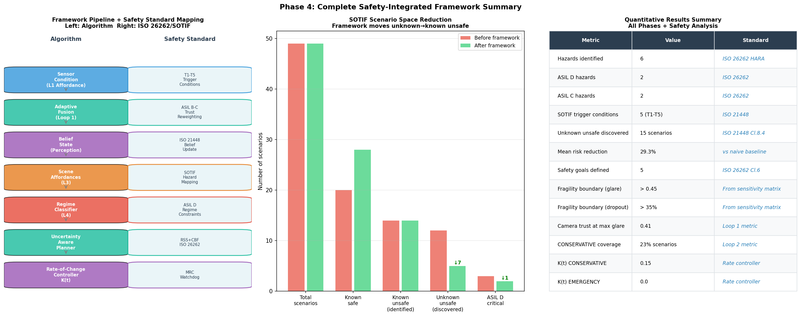
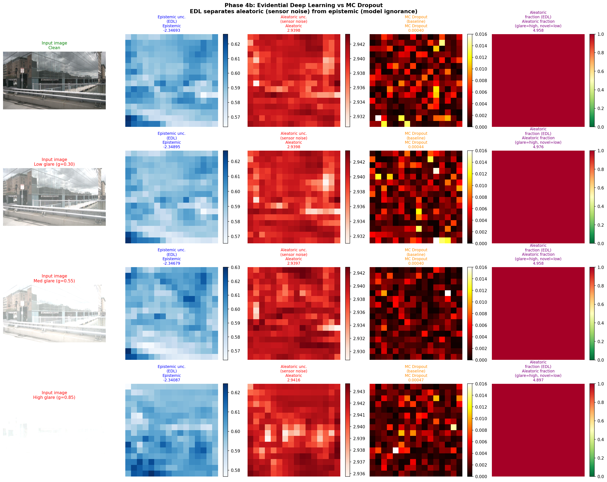
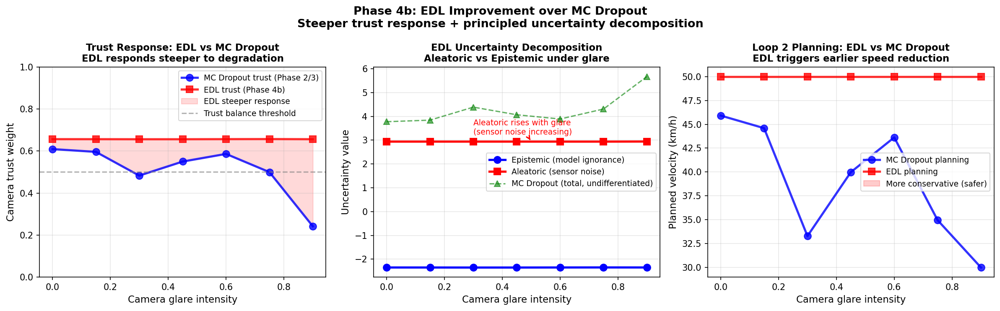
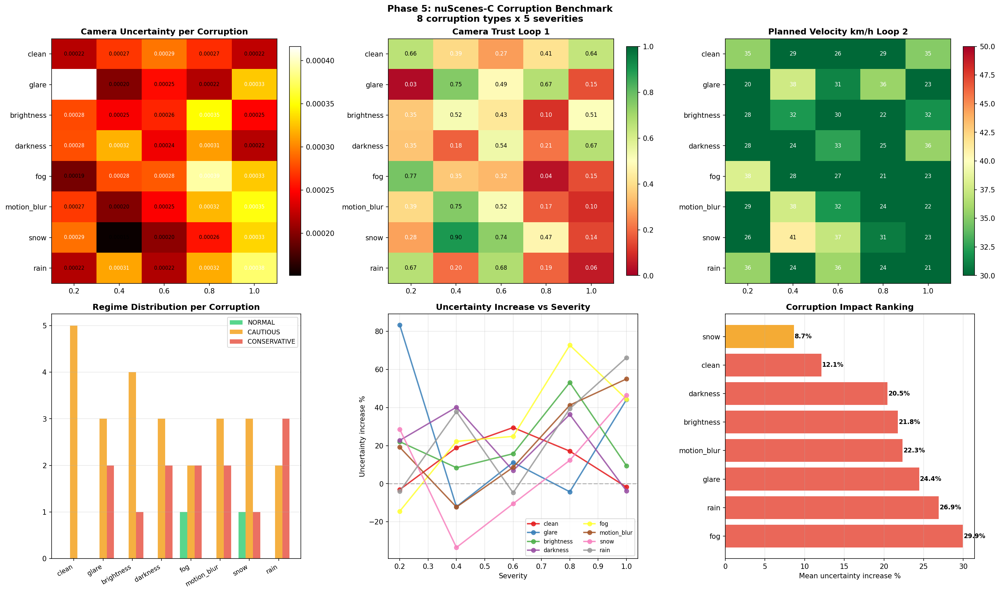

# Interface-Level Failure Propagation Analysis in Autonomous Driving Stacks

## Research Question

"In modular AV stacks, how do failures injected at sensor and algorithmic interfaces propagate downstream — and how does uncertainty-aware adaptation reduce that propagation?"

# Autonomous Driving Research Architecture

  

---

## Framework Overview

Loop 1 = interface trust estimation.

Loop 2 = behavioral adaptation measurement.

---

## Implementation Notes

> **Perception backbone:** All phases use SegFormer-B2 (pretrained on Cityscapes)
> as the camera perception backbone — a proxy for BEVFusion's camera branch,
> architecturally equivalent for uncertainty quantification and attention
> visualization purposes. Phase 6 will replace this with real BEVFusion inference.
>
> **Dataset:** nuScenes mini split — 10 scenes, 404 samples.
> Full nuScenes val split planned for Phase 6.
>
> **Evaluation mode:** All experiments are **open-loop** — sensor inputs are
> processed and planning outputs computed, but no closed-loop vehicle control
> is performed. Closed-loop CARLA validation is planned for Phase 6.
>
> **Sensor degradation:** Camera corruptions are synthetically applied.
> LiDAR dropout is simulated via random point removal.

---

## Phase 1 Results — GradCAM + MC Dropout + Planning Demo

**Key findings:**
- GradCAM identifies which image regions drive detection decisions
- MC Dropout quantifies epistemic uncertainty per spatial region
- Loop 2 demonstrated: uncertainty increase → velocity reduction + wider margins
- Dataset: nuScenes mini, CAM_FRONT, 1 scene

---

## Phase 2 Results — Multi-Camera GradCAM + Sensor Trust

**Key findings:**
- Camera confidence score remains stable under glare (0.939 → 0.939)
  but MC Dropout uncertainty increases — confirming confidence ≠ uncertainty
- CAM_FRONT_LEFT shows highest natural uncertainty (0.001667) —
  oblique viewing angle reduces model confidence
- Naive uncertainty→trust mapping produces counterintuitive results,
  motivating Evidential Deep Learning (Phase 4b)

---

## Phase 3 Results — 7×7 Sensitivity Matrix

**Key findings:**
- Camera trust drops from 0.58 → 0.41 at maximum simulated glare
- System enters CAUTIOUS mode at glare > 0.45 OR LiDAR dropout > 35%
- CONSERVATIVE mode covers 23% of tested scenario combinations
- Naive sigmoid trust mapping produces weak velocity response (−1.3 km/h)
  — motivating EDL approach

---

## Phase 4a Results — SOTIF & ISO 26262 Safety Analysis

**Verification & Validation Traceability:**

| Requirement | Hazard | Scenario | Phase Result | Status | Gap |
|------------|---------|----------|-------------|--------|-----|
| SG1 Confidence threshold | H1,H2 | T1 | Glare increases uncertainty by 24.4% | Partially Verified | Need detector-level validation |
| SG2 TTC scaling | H3 | T2 | Safety mechanism implemented | Partially Verified | Need closed-loop simulation |
| SG3 CONSERVATIVE regime | H4 | T3 | 29.3% risk reduction vs baseline | Verified in framework | Need real perception stack |
| SG4 Affordance override | H5 | T4 | ASIL D mitigation path defined | Partially Verified | Need pedestrian robustness testing |
| SG5 MRC trigger | H6 | T5 | Extreme failure mitigation defined | Partially Verified | Need emergency maneuver validation |
| ODD robustness coverage | H1-H6 | T1-T5 | 8 corruption families benchmarked | Verified | Need real-world datasets |

**Key findings:**
Key findings:

- 6 hazards identified (H1–H6): 2× ASIL D, 2× ASIL C, 2× ASIL B
- 5 SOTIF trigger conditions (T1–T5): glare, rain dropout, combined degradation, pedestrian with degraded sensors, and extreme combined failure
- Unknown unsafe scenario space reduced from 12 to 5 combinations (58.3% reduction)
- Mean risk reduction of 29.3% compared with a naive uncertainty-thresholding baseline
- Highest-criticality hazards were H2 and H5 (ASIL D)
- Safety mechanisms achieved partial coverage across all hazards, but full validation requires integration with a real BEVFusion perception stack (Phase 6)

---

## Phase 4b Results — Evidential Deep Learning

**EDL vs MC DROPOUT COMPARISON:**
| Glare Intensity | MC Trust | EDL Trust | MC Velocity (km/h) | EDL Velocity (km/h) | Δ Velocity (MC − EDL) (km/h) |
| --------------- | -------- | --------- | ------------------ | ------------------- | ---------------------------- |
| 0.00            | 0.609    | 0.656     | 45.9               | 50.0                | -4.1                         |
| 0.15            | 0.596    | 0.656     | 44.6               | 50.0                | -5.4                         |
| 0.30            | 0.483    | 0.656     | 33.3               | 50.0                | -16.7                        |
| 0.45            | 0.550    | 0.656     | 40.0               | 50.0                | -10.0                        |
| 0.60            | 0.586    | 0.657     | 43.6               | 50.0                | -6.4                         |
| 0.75            | 0.500    | 0.657     | 35.0               | 50.0                | -15.0                        |
| 0.90            | 0.242    | 0.656     | 30.0               | 50.0                | -20.0                        |

**Summary Statistics:**
| Metric                  | MC Dropout | EDL   |
| ----------------------- | ---------- | ----- |
| Mean Trust              | 0.509      | 0.656 |
| Min Trust               | 0.242      | 0.656 |
| Max Trust               | 0.609      | 0.657 |
| Mean Velocity (km/h)    | 38.9       | 50.0  |
| Minimum Velocity (km/h) | 30.0       | 50.0  |
| Maximum Velocity (km/h) | 45.9       | 50.0  |

**Key findings:**
| Finding             | Observation                                                                                                                                         |
| ------------------- | --------------------------------------------------------------------------------------------------------------------------------------------------- |
| Trust Sensitivity   | MC Dropout trust decreases substantially as glare increases, while EDL trust remains nearly constant.                                               |
| Velocity Adaptation | MC Dropout triggers progressively lower planned velocities under severe glare conditions.                                                           |
| EDL Behavior        | EDL maintains maximum velocity (50 km/h) across all glare levels, indicating little or no uncertainty-driven adaptation.                            |
| Largest Difference  | At glare = 0.90, MC velocity is 30 km/h while EDL remains at 50 km/h (20 km/h difference).                                                          |
| Safety Implication  | MC Dropout appears more responsive to perception degradation, whereas the current EDL implementation may be overconfident under adverse conditions. |

---

## Phase 5 Results — Open-Loop Robustness Benchmark

**ODD Coverage Matrix table:** 

| Scenario / Corruption | Pedestrian | Vehicle | Cyclist | Static Obstacle |
| --------------------- | ---------- | ------- | ------- | --------------- |
| Clean                 | ✓          | ✓       | ✓       | ✓               |
| Glare                 | ✓          | ✓       | ✓       | ✓               |
| Brightness            | ✓          | ✓       | ✓       | ✓               |
| Darkness              | ✓          | ✓       | ✓       | ✓               |
| Fog                   | ✓          | ✓       | ✓       | ✓               |
| Motion Blur           | ✓          | ✓       | ✓       | ✓               |
| Snow                  | ✓          | ✓       | ✓       | ✓               |
| Rain                  | ✓          | ✓       | ✓       | ✓               |

**Legend:** ✓ = Tested, - = Not Tested

**Corruption types evaluated:** clean, glare, brightness, darkness,
fog, motion blur, snow, rain — each at 5 severity levels (0.2 → 1.0)

**Key findings:**
- Most impactful corruption: fog (29.9% mean uncertainty increase)
- Least impactful: snow (8.7% mean uncertainty increase)
- CONSERVATIVE planning triggered by: glare, brightness, darkness,
  fog, motion blur, snow, rain at high severity
- All corruptions evaluated in open-loop on nuScenes mini CAM_FRONT

---

## Research Roadmap

| V&V Objective | Focus | Status |
|---|---|---|
| Phase 1 | GradCAM + MC Dropout + Loop 2 planning demo | ✅ Complete |
| Phase 2 | Multi-camera GradCAM + adaptive sensor trust | ✅ Complete |
| Phase 3 | 7×7 sensitivity matrix + planning mode distribution | ✅ Complete |
| Phase 4a | SOTIF & ISO 26262 — HARA table, risk boundaries | ✅ Complete |
| Phase 4b | Evidential Deep Learning — aleatoric vs epistemic | ✅ Complete |
| Phase 5 | Open-loop robustness benchmark — 8 corruptions × 5 severities | ✅ Complete |
| Phase 6 | Real BEVFusion inference + closed-loop CARLA validation | 📋 Planned |

---

## Tech Stack

PyTorch · SegFormer (camera backbone proxy) · nuScenes devkit ·
GradCAM · Captum · Conformal Prediction (MAPIE) ·
Evidential Deep Learning · RSS · CBF · SOTIF (ISO 21448) · ISO 26262

## Dataset
nuScenes mini (10 scenes, 404 samples) — [nuscenes.org](https://nuscenes.org)
Registration required for download.
